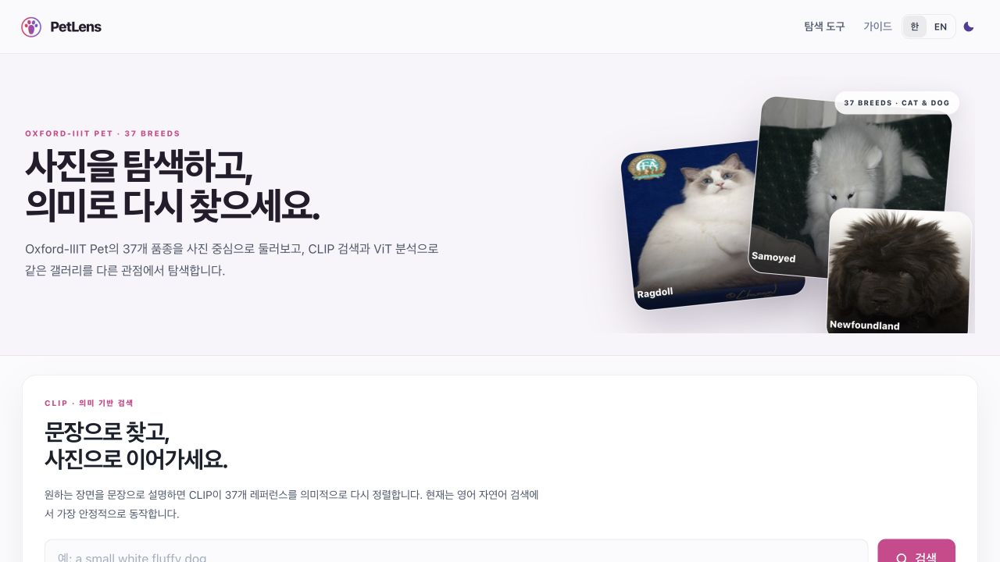
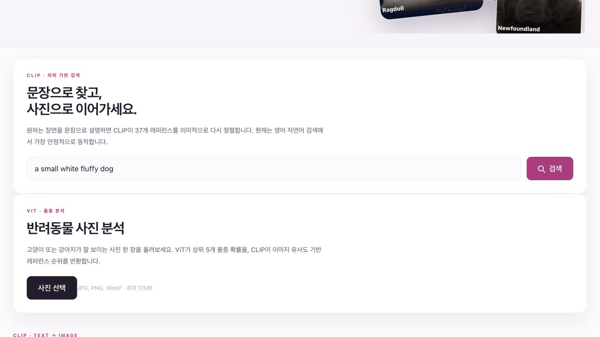
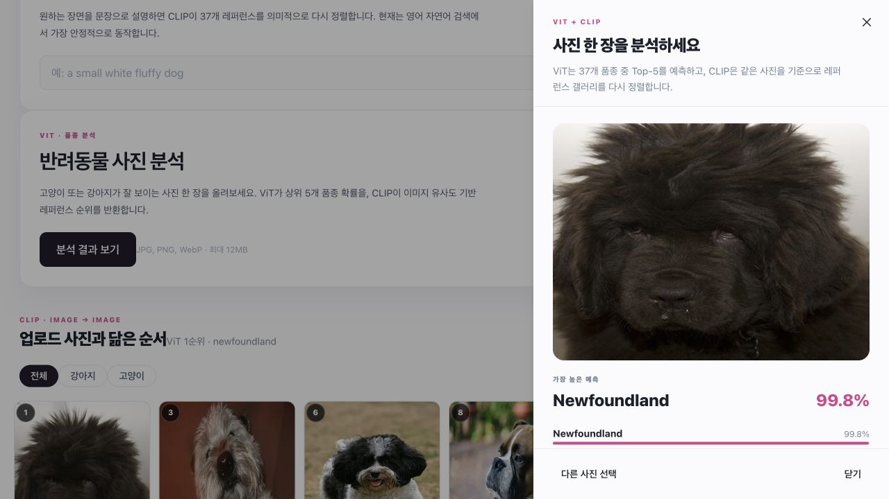
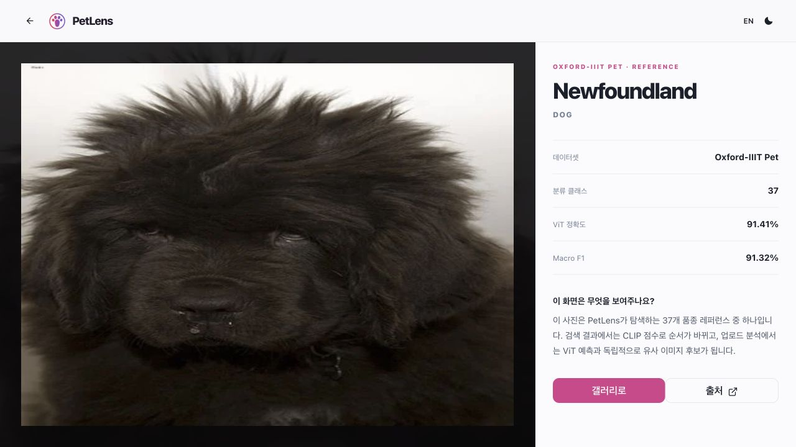
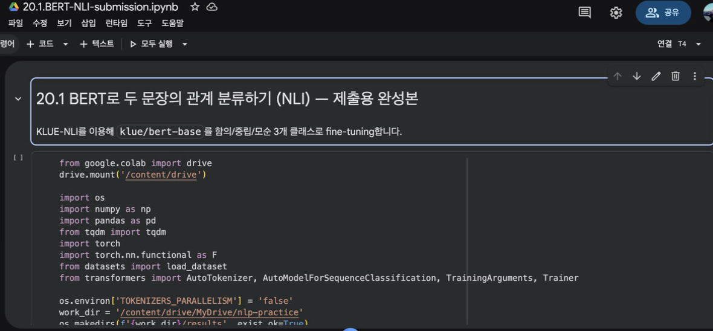
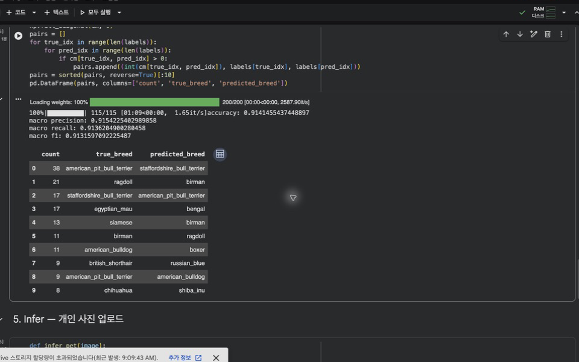
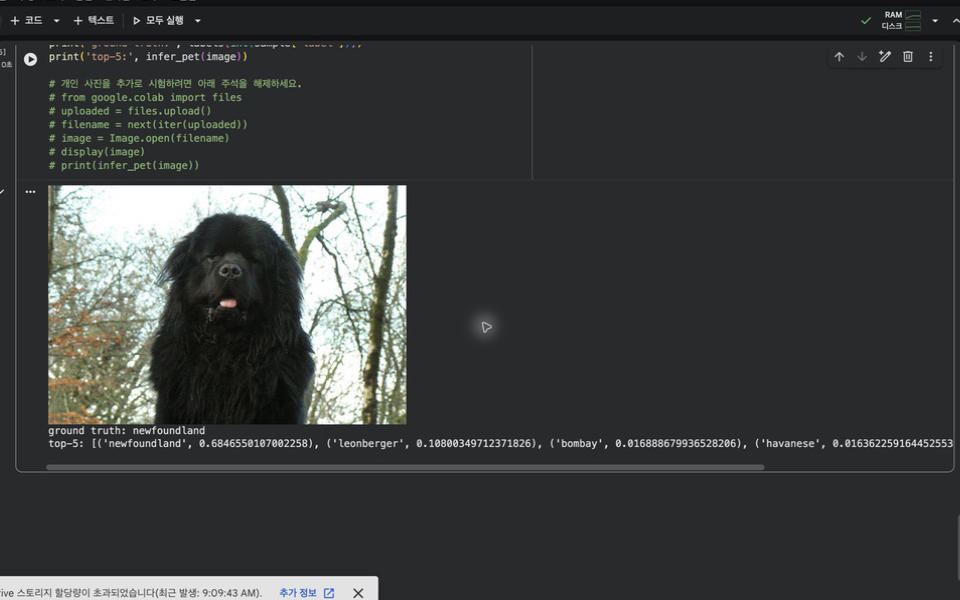
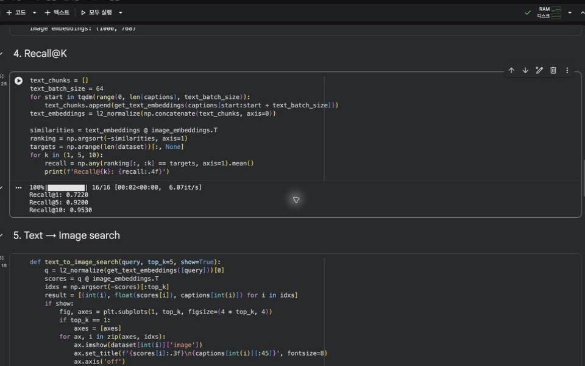
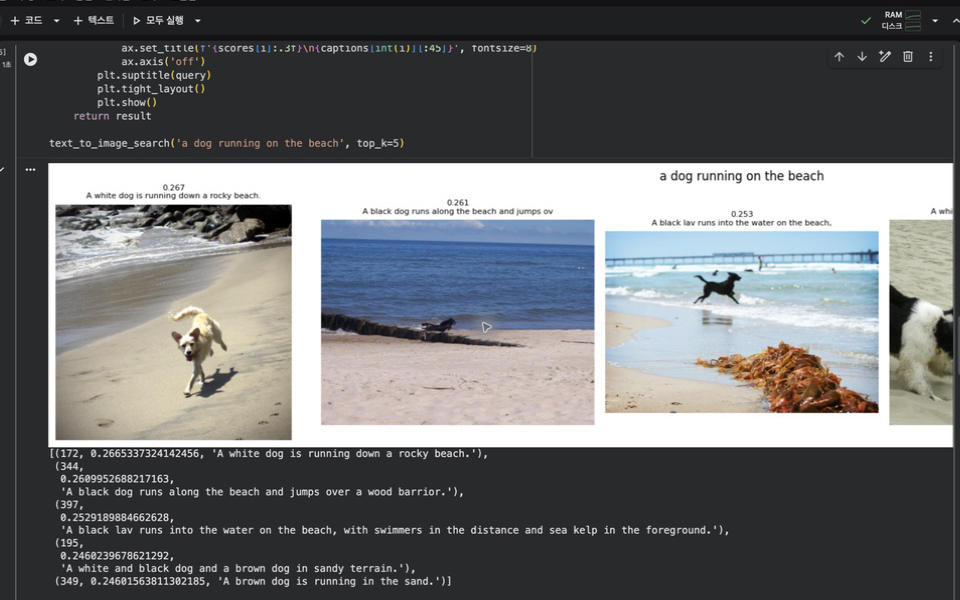
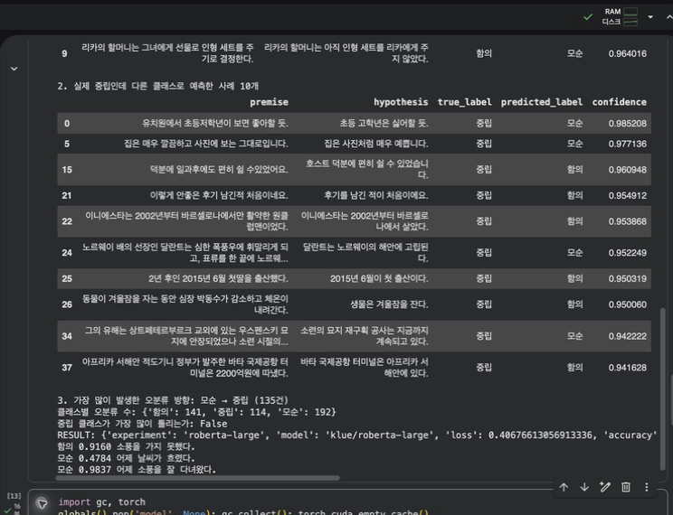

# PetLens

**Pet detection + ViT fine-tuning + CLIP semantic retrieval을 실제 웹 서비스 흐름으로 연결한 멀티모달 개인 프로젝트**

GitHub: https://github.com/oosuhada/petlens-ai

Live demo: **[petlens.oosu.dev](https://petlens.oosu.dev/)** · [시작하기](https://petlens.oosu.dev/onboarding) · [사용 가이드](https://petlens.oosu.dev/guide) · [Newfoundland 상세](https://petlens.oosu.dev/photos/newfoundland)

PetLens는 「생성형 AI 기반 멀티모달 AI 서비스 개발 과정」에서 진행한 이미지 분류·멀티모달 검색 실습을 Colab 노트북 결과로 끝내지 않고, 브라우저에서 직접 사용할 수 있는 작은 웹 서비스로 연결한 프로젝트입니다.

- **ViT**: Oxford-IIIT Pet 37개 품종 분류, Top-5 prediction
- **Dog-130 ViT**: Tsinghua Dogs 130개 강아지 품종 분류, production에서 dog detection에 우선 적용
- **Dog-130 ViT**: Tsinghua Dogs 130개 개 품종 확장 classifier (hierarchical dog branch)
- **CLIP**: 자연어 → 이미지 검색, 이미지 → 유사 이미지 검색
- **Grounding DINO**: 복잡한 사진에서 cat / dog 위치 감지, 여러 마리 개별 crop 분석
- **SAM2**: 감지된 반려동물 segmentation 및 짧은 영상 object tracking
- **SigLIP2 / DINOv2**: zero-shot 품종 비교와 visual retrieval 비교
- **ViTPose++ (AP-10K expert)**: 고양이·강아지 17-keypoint animal pose estimation
- **Web**: Next.js + Chakra UI
- **ML serving**: FastAPI + PyTorch + Hugging Face Transformers

현재 `main`은 PetLens 2.0 개발선입니다. 기존 37-class 단일 이미지 분석 버전은 `petlens-1.0` 브랜치에 보존했습니다.

현재 production은 hierarchical classifier 구조입니다. Grounding DINO가 `dog`를 감지하면 Colab A100에서 학습한 Dog-130 checkpoint를 사용하고, `cat`은 기존 Oxford-IIIT Pet 37-class classifier를 유지합니다. Dog-130 최종 validation은 Accuracy **0.8679**, Macro F1 **0.8664**이며 model weight는 GitHub에 포함하지 않고 Mac mini의 별도 모델 경로에서 로드합니다.

> UI는 사진 탐색에 집중한 기존 갤러리의 색상, 카드 비율, 검색바, 상세 페이지 흐름을 유지하고 Pexels 기능을 Oxford-IIIT Pet + ViT/CLIP 기능으로 교체했습니다.

---

## Web demo

### 1. 37개 품종 갤러리

Oxford-IIIT Pet의 37개 클래스가 웹 갤러리의 탐색 단위가 됩니다.



### 2. CLIP 자연어 이미지 검색

영문 자연어를 CLIP text embedding으로 변환하고, 37개 reference image embedding과 cosine similarity로 비교해 결과를 재정렬합니다.

예시 query: `a small white fluffy dog`

실제 smoke-test 결과 상위 항목은 Samoyed → Havanese → Great Pyrenees 순으로 검색되었습니다.



### 3. 사진 업로드 → pet detection + 개체별 ViT / CLIP 분석

PetLens 2.0은 업로드 이미지를 바로 전체-frame classifier에 넣지 않습니다.

1. Grounding DINO → 사진 속 cat / dog bounding box 감지
2. 감지된 개체별 crop 생성
3. 각 crop을 ViT classifier에 입력 → 37개 품종 중 Top-5 확률
4. 각 crop을 CLIP image encoder에 입력 → gallery 유사 이미지 검색
5. 여러 마리가 감지되면 각 개체 결과를 독립적으로 반환

강아지와 고양이를 한 장으로 합친 Mac mini 실제 검증에서는 두 개체를 각각 `dog`, `cat`으로 감지했고, 개별 ViT 결과가 Chihuahua와 Ragdoll로 분리되었습니다. 같은 crop으로 실행한 CLIP 검색도 각각 Chihuahua, Ragdoll 레퍼런스를 1위로 반환했습니다.

새 통합 endpoint는 `POST /analyze`이며 detection → classification → retrieval을 한 요청에서 처리합니다. detector를 불러오지 못하거나 box를 찾지 못하면 전체 이미지를 분석하는 fallback을 유지합니다.



### 4. PetLens 2.0 고급 분석

현재 `main`에는 다음 확장 endpoint도 포함되어 있습니다.

- `POST /open-set/siglip2`: ViT 결과와 SigLIP2 zero-shot 품종 순위를 비교합니다. 불일치는 오답 확정이 아니라 open-set / ambiguity 신호로 사용합니다.
- `POST /compare/retrieval`: 같은 pet crop을 CLIP과 DINOv2 feature space에서 각각 검색해 순위를 비교합니다.
- `POST /pose`: Grounding DINO box를 ViTPose++ AP-10K expert에 전달해 동물 keypoint를 반환합니다.
- `POST /analyze/video`: 짧은 영상을 샘플링하고 첫 프레임 detection → SAM2 tracking → track별 ViT / CLIP 집계를 수행합니다.

영상 기능은 Mac mini에서의 실시간 스트리밍이 아니라 짧은 업로드 영상을 대상으로 한 batch 분석입니다. CPU/MPS serving 비용을 제한하기 위해 기본적으로 최대 12개 프레임을 샘플링합니다.

### 5. 품종 상세 화면

기존 사진 갤러리의 detail-page 문법을 유지하고, 해당 품종이 학습 데이터의 37개 클래스 중 하나임을 연결했습니다.



---

## From notebook to service

이 프로젝트의 핵심은 웹 UI 자체보다 **실제 학습·평가한 모델 작업을 서비스 인터랙션으로 연결한 과정**입니다.

### Colab 실행 환경 요약

원 과제 notebook 실행은 Colab GPU 런타임에서 진행했습니다. 20.2 ViT fine-tuning과 20.3 CLIP retrieval 평가는 T4 런타임에서 완료했고, 20.1 KLUE-NLI의 추가 성능 확장 실험은 더 많은 backbone 비교를 빠르게 돌리기 위해 A100 런타임에서 별도로 진행했습니다. GPU 종류 자체가 정확도를 올린다고 보지는 않고, 동일한 학습·평가를 더 빠르게 반복하기 위한 실행 환경 차이로 기록합니다.

| Notebook / experiment | Main task | Colab GPU |
| --- | --- | --- |
| 20.1 BERT-NLI baseline | KLUE-NLI BERT fine-tuning | T4 |
| 20.2 ViT-Pet | Oxford-IIIT Pet 37-class fine-tuning | T4 |
| 20.3 ImageSearch | Flickr30k 1,000-image CLIP retrieval | T4 |
| 20.1 NLI extension | BERT/RoBERTa/KorNLI 비교 실험 | A100 |

### ViT fine-tuning — Oxford-IIIT Pet

`google/vit-base-patch16-224`를 37개 반려동물 품종으로 fine-tuning했습니다.

| Metric | Result |
| --- | ---: |
| Accuracy | **0.91415** |
| Macro Precision | **0.91542** |
| Macro Recall | **0.91362** |
| Macro F1 | **0.91316** |

#### Colab T4 학습 환경



#### 평가 및 혼동 품종 분석



#### 실제 이미지 Top-5 inference



### Dog-130 fine-tuning — Tsinghua Dogs

PetLens 2.0의 dog branch를 37-class 한계에서 확장하기 위해 `google/vit-base-patch16-224`를 Tsinghua Dogs 130개 품종에 fine-tuning했습니다. 학습은 전체 train 65,228장 / validation 5,200장을 사용해 3 epochs 수행했고, A100 40GB에서 batch size 32 / 64를 유지했습니다.

| Metric | Result |
| --- | ---: |
| Validation Accuracy | **0.86788** |
| Macro Precision | **0.88130** |
| Macro Recall | **0.86788** |
| Macro F1 | **0.86636** |
| Classes | **130** |
| GPU | **NVIDIA A100-SXM4-40GB** |

Production API는 `PETLENS_DOG130_MODEL`이 설정되면 Grounding DINO가 `dog`로 감지한 개체에 Dog-130 classifier를 우선 사용하고, `cat`은 기존 Oxford-IIIT Pet 37-class classifier를 유지합니다. Dog-130 checkpoint가 없거나 로딩에 실패하면 기존 37-class 모델로 안전하게 fallback합니다.

### CLIP retrieval — Flickr30k

`openai/clip-vit-large-patch14`의 image/text embedding을 사용해 Flickr30k 1,000장에 대한 retrieval을 평가했습니다.

| Metric | Result |
| --- | ---: |
| Recall@1 | **0.7220** |
| Recall@5 | **0.9200** |
| Recall@10 | **0.9530** |

#### Retrieval 평가



#### Text → Image 검색



---

## Additional NLP experiment

이미지 프로젝트와 별도로 KLUE-NLI도 진행했습니다. BERT에서 단순 하이퍼파라미터 변경만 반복하기보다 backbone과 학습 데이터의 영향을 비교했습니다.

| Experiment | Data | GPU | Accuracy | Macro F1 | Neutral Recall |
| --- | --- | --- | ---: | ---: | ---: |
| BERT baseline | KLUE-NLI | T4 | 0.8017 | - | - |
| BERT tuned best | KLUE-NLI | A100 | 0.8080 | 0.8076 | 0.7930 |
| RoBERTa-base | KLUE-NLI | A100 | 0.8343 | 0.8340 | 0.8700 |
| RoBERTa-large | KLUE-NLI | A100 | 0.8510 | 0.8513 | 0.8860 |
| **RoBERTa-large + KorNLI** | **KLUE-NLI + KorNLI human-translated train augmentation** | **A100** | **0.8647** | **0.8647** | **0.8790** |

최종 확장 실험은 KLUE validation 3,000건을 평가 전용으로 유지하고, KorNLI human-translated 6,520건만 train 쪽에 추가했습니다. 기존 BERT 제출본은 보존하고, RoBERTa-large + KorNLI 결과는 별도 확장 제출 후보로 분리했습니다.



---

## Architecture

```text
Browser / Next.js + Chakra UI
        │
        ├── text query ───────────────┐
        │                              ▼
        │                    CLIP text encoder
        │                              │
        │                              ▼
        │                 normalized gallery embeddings
        │                              │
        │                              ▼
        │                       ranked pet images
        │
        └── uploaded image ────────────┬─────────────────────┐
                                      │                     │
                                      ▼                     ▼
                           ViT image classifier       CLIP image encoder
                                      │                     │
                                      ▼                     ▼
                            Top-5 breed scores       similar pet images

                         FastAPI ML adapter
                                │
                         PyTorch / Transformers
```

프론트엔드와 모델 런타임은 분리했습니다. 모델 checkpoint를 교체해도 UI 코드를 다시 작성하지 않아도 됩니다.

---

## Implementation

### Existing UI를 유지한 이유

처음부터 새로운 AI 서비스 UI를 만들기보다, 사진 탐색 서비스로 이미 완성된 디자인 문법을 가진 `next-image-gallery`를 기반으로 삼았습니다.

유지한 요소:

- lavender background
- centered / underlined title
- ghost search field + pink search action
- rounded photo card와 hover elevation
- gray detail page + pill-shaped home action

교체·추가한 요소:

- Pexels API → Oxford-IIIT Pet 37-class catalog
- keyword/API search → CLIP semantic retrieval
- image upload → ViT Top-5 classification
- image upload → CLIP image-to-image retrieval
- FastAPI ML adapter
- 모델 실험 결과와 서비스 runtime 분리

### Reference image catalog

웹 데모에는 각 클래스당 1장의 representative image를 사용합니다. 이미지는 repository에 복제하지 않고 공개 연구 mirror `guebin/oxford-pets-cascam`의 `original/` 경로를 참조합니다.

---

## Runtime and checkpoint note

### ViT

과제에서 직접 학습한 ViT run은 Colab에서 **Accuracy 91.41% / Macro F1 91.32%**를 기록했습니다. 해당 실행 notebook은 별도 제출물로 보존되어 있습니다.

Colab runtime을 삭제한 뒤 local machine에는 그 checkpoint weight 자체가 남아 있지 않았기 때문에, 웹 runtime은 다음 순서로 모델을 선택합니다.

1. `PETLENS_VIT_MODEL`이 지정되어 있으면 해당 checkpoint 사용
2. 지정되지 않으면 동일한 `google/vit-base-patch16-224` + Oxford-IIIT Pet 37-class 구조의 공개 checkpoint `rakib730/vit-base-oxford-iiit-pets`를 runtime fallback으로 사용

웹 smoke test에서 fallback 결과를 과제의 91.41% 성능이라고 주장하지 않습니다. 과제 성능 근거는 위 Colab 실행 결과입니다.

### CLIP

기본 runtime은 과제 20.3과 같은 `openai/clip-vit-large-patch14`입니다.

README의 웹 기능 캡처는 로컬 기능 검증 시간을 줄이기 위해 `PETLENS_CLIP_MODEL=openai/clip-vit-base-patch32`로 동일 retrieval pipeline을 smoke-test했습니다. 과제의 Recall@K 수치는 별도의 Colab `clip-vit-large-patch14` 실행 결과입니다.

---

## API

FastAPI adapter의 주요 endpoint:

| Endpoint | Purpose |
| --- | --- |
| `GET /health` | device / model / gallery index 상태 |
| `POST /classify` | 이미지 → ViT Top-5 품종 |
| `POST /search/text` | 자연어 → CLIP gallery ranking |
| `POST /search/image` | 이미지 → CLIP gallery ranking |

Gallery embedding은 첫 검색 시 생성하고 process memory에 cache합니다.

---

## Run locally

```bash
npm ci
python3 -m venv .venv
.venv/bin/pip install -r ml_service/requirements.txt
```

직접 학습한 ViT checkpoint가 있다면:

```bash
export PETLENS_VIT_MODEL=/absolute/path/to/results/vit-pet/best
```

두 서비스를 함께 시작합니다.

```bash
chmod +x run_local.sh
./run_local.sh
```

브라우저에서 `http://127.0.0.1:3000`을 엽니다.

> 현재 Node/OpenSSL 조합에서 production build 시 `NODE_OPTIONS=--openssl-legacy-provider`를 사용합니다. UI의 원형을 유지하기 위해 과제 범위에서 프레임워크 자체를 대규모 마이그레이션하지 않았습니다.

---

## Repository structure

```text
petlens-ai/
├── data/pets.json             # 37-class web catalog
├── docs/screenshots/          # Colab evidence + real web captures
├── lib/
│   ├── api.js                 # browser ↔ FastAPI client
│   └── catalog.js             # gallery mapping
├── ml_service/
│   ├── app.py                 # ViT + CLIP FastAPI adapter
│   └── requirements.txt
├── pages/
│   ├── index.js               # gallery / search / upload analysis
│   └── photos/[id].js         # breed detail
├── run_local.sh
└── README.md
```

---

## Coursework submission

최종 제출본에는 이 웹 프로젝트와 함께 다음 실행 notebook을 보존했습니다.

- `20.1_BERT_NLI_FINAL.ipynb`
- `20.2_ViT_Pet_FINAL.ipynb`
- `20.3_CLIP_ImageSearch_FINAL.ipynb`
- `20.1_NLI_RoBERTaLarge_KorNLI_BEST.ipynb`
- `20.1_NLI_Extension_Comparison.ipynb`

---
